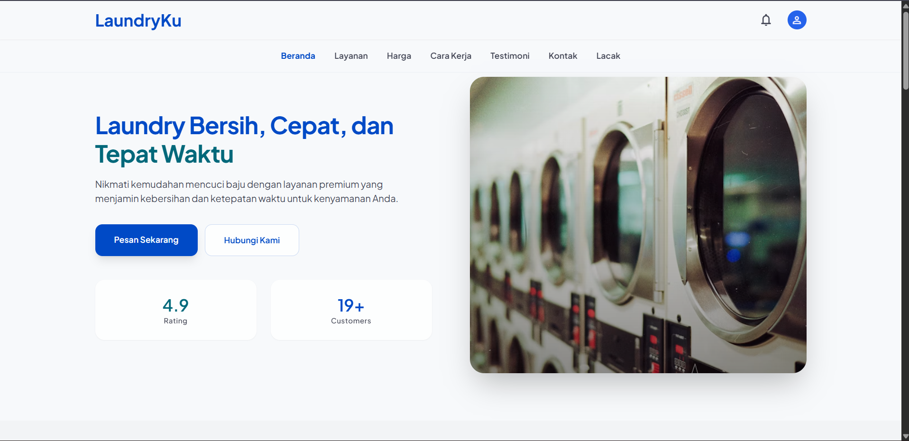
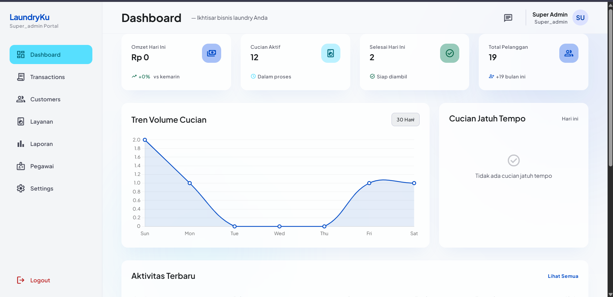
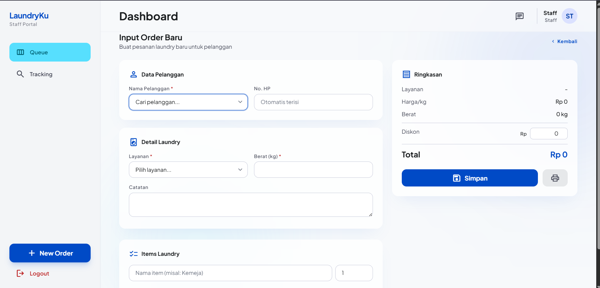

<div align="center">
  
  
  
  
  <br>
  
  
  
  
</div>

<h1 align="center">🧺 CleanTrack — Laundry POS & Management System</h1>

<p align="center">
  A modern, feature-rich laundry management system with glass-morphism UI, real-time tracking, role-based dashboards, and WhatsApp integration.
</p>

---

## ✨ Features

### 👥 Multi-Role Access
| Role | Access |
|------|--------|
| **Super Admin** | Full control — dashboard, transactions, customers, services, employees, reports, settings |
| **Admin** | Dashboard, transactions, customers, services, reports |
| **Staff** | POS order creation, queue management (kanban + card grid), order tracking |
| **Customer** | Personal dashboard, order history, progress tracking, rating |

### 🧾 POS & Transactions
- **Staff POS** — Create orders with customer selection, dynamic item list, live price calculator, discount input
- **Admin POS** — Full transaction management with export (PDF/printable)
- **Invoice generation** — Auto-generated invoice numbers (`INV-YYYYMMDD-NNNN`)
- **Payment tracking** — Status: unpaid, partial (DP), paid — with payment history
- **Order status flow** — Pending → Washed → Dried → Ironed → QC → Completed → Picked up

### 📊 Dashboard & Analytics
- **Admin dashboard** — Daily revenue, active orders, growth %, 7-day chart (Chart.js), due-soon orders, recent activity
- **Customer dashboard** — Active laundry count, history, completed orders with ratings
- **Reports** — Revenue, customer, and service analytics with date filtering and Chart.js

### 📍 Real-Time Tracking
- **Public tracking** — Anyone can track order status by invoice number (no login required)
- **Customer tracking** — Authenticated customers see full progress timeline + history
- **Staff queue** — Two views: Kanban board (columns by status) and Card grid with quick-action buttons
- **5-step progress** — Diterima → Dicuci → Dikeringkan → Disetrika → QC

### 🎨 Glass UI Design
- **Glass-morphism** — `backdrop-filter: blur(20px)`, semi-transparent cards with subtle borders
- **Material Symbols** — Iconography throughout the interface
- **Plus Jakarta Sans** — Modern, clean typography
- **Responsive** — Mobile-first with dedicated desktop layouts
- **Micro-interactions** — Press-scale, card hover lift, smooth transitions

### 💬 WhatsApp Integration
- **Direct chat** — One-click WhatsApp links to customer phone numbers
- **Order notifications** — Share order status via WhatsApp
- **Contact support** — WhatsApp button on landing page

### ⚙️ Settings & Management
- **App settings** — Business info, hero section, WhatsApp number, description (stored in DB)
- **Service management** — CRUD for laundry services (price/kg, estimated days, active status)
- **Employee management** — CRUD for staff accounts
- **Customer CRM** — Customer list with search, quick-add modal, transaction count, loyalty stats
- **Danger zone** — Reset all data, export full data as JSON

---

## 🖥️ Screenshots

<div align="center">
  
  <br>
  
  <br>
  
</div>

| Page | Description |
|------|-------------|
| `/` | Landing page — hero, services, pricing, how-it-works, testimonials, contact |
| `/tracking` | Public order tracking — search by invoice, progress timeline |
| `/login` | Login form — glass-card centered layout |
| `/admin/dashboard` | Admin dashboard — stats, chart, activity feed |
| `/admin/transaksi` | Transaction list — filters, export, CRUD |
| `/admin/pelanggan` | Customer management — search, add modal, stats |
| `/admin/layanan` | Service CRUD |
| `/admin/pegawai` | Employee CRUD |
| `/admin/laporan` | Reports — revenue, customer, service analytics |
| `/admin/pengaturan` | App settings |
| `/staff/order` | POS — create order with dynamic items |
| `/staff/order/queue` | Queue — card grid with filter tabs & quick actions |
| `/staff/tracking` | Staff order tracking |
| `/pelanggan/dashboard` | Customer dashboard |
| `/pelanggan/tracking` | Customer tracking with rating |

---

## 🛠️ Tech Stack

| Technology | Purpose |
|------------|---------|
| **Laravel 13.8** | PHP framework — backend, routing, ORM |
| **PHP 8.3+** | Server-side language |
| **MySQL** | Database |
| **Tailwind CSS 4** (CDN) | Utility-first CSS framework |
| **Chart.js** | Charts & analytics |
| **SweetAlert2** | Modals, confirmations, toasts |
| **Material Symbols** | Icons |
| **Plus Jakarta Sans** | Typography |
| **WhatsApp API** | `wa.me` link generation |
| **Blade** | Templating engine |

---

## 🚀 Installation

### Prerequisites
- PHP 8.3+
- Composer
- MySQL
- Node.js (optional, for Vite)

### Steps

```bash
# 1. Clone the repository
git clone https://github.com/uroo-dev/cleantrack-laundry-pos.git
cd cleantrack-laundry-pos

# 2. Install PHP dependencies
composer install

# 3. Copy environment file
cp .env.example .env

# 4. Generate application key
php artisan key:generate

# 5. Configure database in .env
# DB_CONNECTION=mysql
# DB_HOST=127.0.0.1
# DB_PORT=3306
# DB_DATABASE=cleantrack
# DB_USERNAME=root
# DB_PASSWORD=

# 6. Run migrations
php artisan migrate

# 7. (Optional) Seed database
php artisan db:seed

# 8. Start development server
php artisan serve
```

### Default Accounts (if seeded)
| Role | Email | Password |
|------|-------|----------|
| Super Admin | `admin@cleantrack.com` | `password` |
| Staff | `staff@cleantrack.com` | `password` |
| Customer | `customer@cleantrack.com` | `password` |

---

## 📁 Project Structure

```
app/
├── Http/
│   ├── Controllers/
│   │   ├── Admin/          # Admin controllers (dashboard, pelanggan, layanan, transaksi, pegawai, laporan, pengaturan)
│   │   ├── Auth/           # Login & Register controllers
│   │   ├── Customer/       # Customer dashboard & tracking
│   │   ├── Staff/          # Staff order & tracking controllers
│   │   └── PublicController.php
│   └── Middleware/
│       └── CheckRole.php   # Role-based access middleware
├── Models/
│   ├── User.php
│   ├── Pelanggan.php       # Customer model
│   ├── Layanan.php         # Service model
│   ├── Transaksi.php       # Transaction model (with accessors)
│   ├── DetailLaundry.php
│   ├── Tracking.php
│   ├── Pembayaran.php
│   ├── Rating.php
│   └── Setting.php
├── Providers/
│   └── AppServiceProvider.php  # Global $settings view composer
└── Services/
    └── WhatsAppService.php  # WhatsApp link generator + notification templates

database/migrations/     # Migration files
resources/views/
├── layouts/             # admin.blade.php, auth.blade.php, public.blade.php, print.blade.php
├── admin/               # dashboard, pelanggan, transaksi, layanan, pegawai, laporan, pengaturan
├── staff/               # order (index, create, queue, nota), tracking
├── customer/            # dashboard, tracking
├── auth/                # login, register
└── public/              # home, tracking

routes/web.php           # All web routes
```

---

## 🌐 Routes Overview

### Public
| Method | URI | Action |
|--------|-----|--------|
| GET | `/` | Landing page |
| GET | `/tracking/{kode?}` | Public order tracking |
| GET | `/tracking/download/{kode}` | Download nota (PDF) |

### Auth
| Method | URI | Action |
|--------|-----|--------|
| GET/POST | `/login` | Login |
| GET/POST | `/register` | Register (creates customer account) |
| POST | `/logout` | Logout |

### Admin (`/admin/*`)
| Method | URI | Action |
|--------|-----|--------|
| GET | `/dashboard` | Dashboard stats & charts |
| Resource | `/pelanggan` | Customer CRUD (except show) |
| Resource | `/layanan` | Service CRUD |
| GET/POST | `/transaksi` | Transaction list & create |
| GET | `/transaksi/export` | Export transactions |
| PATCH | `/transaksi/{id}/status` | Update order status |
| PATCH | `/transaksi/{id}/payment` | Update payment status |
| Resource | `/pegawai` | Employee CRUD |
| GET | `/laporan` | Reports |
| GET/POST | `/pengaturan` | Settings |
| POST | `/pengaturan/reset` | Reset all data |
| GET | `/pengaturan/export-data` | Export data as JSON |

### Staff (`/staff/*`)
| Method | URI | Action |
|--------|-----|--------|
| GET/POST | `/order` | POS: create order |
| GET | `/order/queue` | Queue: card grid + filter tabs |
| PUT | `/order/{id}/status` | Update order status |
| GET | `/order/{id}/nota` | View nota |
| GET | `/order/{id}/print` | Print nota |
| GET | `/tracking` | Staff tracking |
| PUT | `/tracking/{id}/progres` | Update progress with forward validation |
| GET | `/tracking/{id}/estimasi` | Get estimated completion date |

### Customer (`/pelanggan/*`)
| Method | URI | Action |
|--------|-----|--------|
| GET | `/dashboard` | Customer dashboard |
| POST | `/tracking` | Check order status |
| GET | `/riwayat` | Order history |
| POST | `/rate` | Submit rating & review |

---

## 📄 License

This project is open-sourced under the [MIT license](LICENSE).

---

<div align="center">
  Built with ❤️ by <a href="https://github.com/uroo-dev">uroo-dev</a>
</div>
